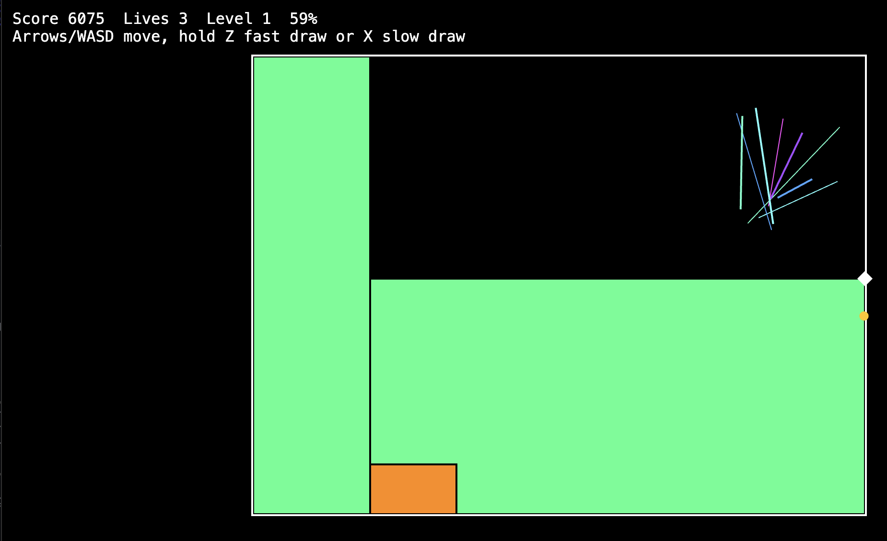

# Qix Replica (WIP)

Lightweight web replica of the classic Qix arcade game, built with TypeScript and PixiJS.



## Run Locally

```
bun install
bun run dev
```

## Controls

- Move: Arrow keys or WASD
- Draw fast: Hold `Z`
- Draw slow: Hold `X`

## Notes

- Level completes at 75% claimed (configurable).
- Fast fill = green, slow fill = orange.

